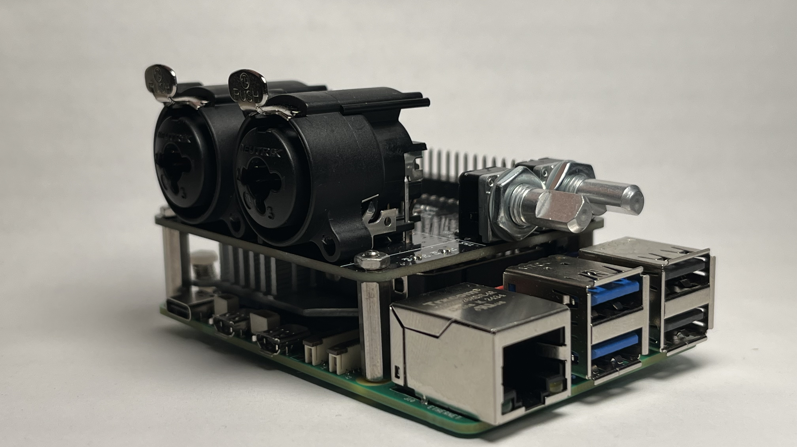
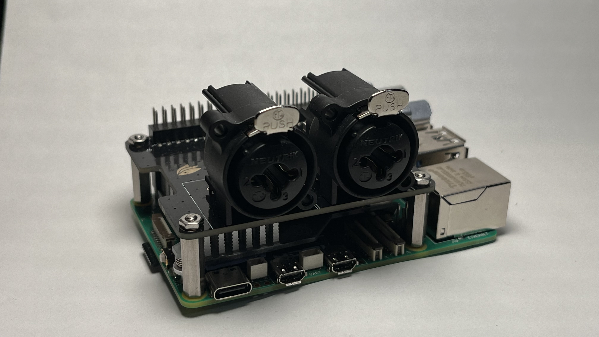
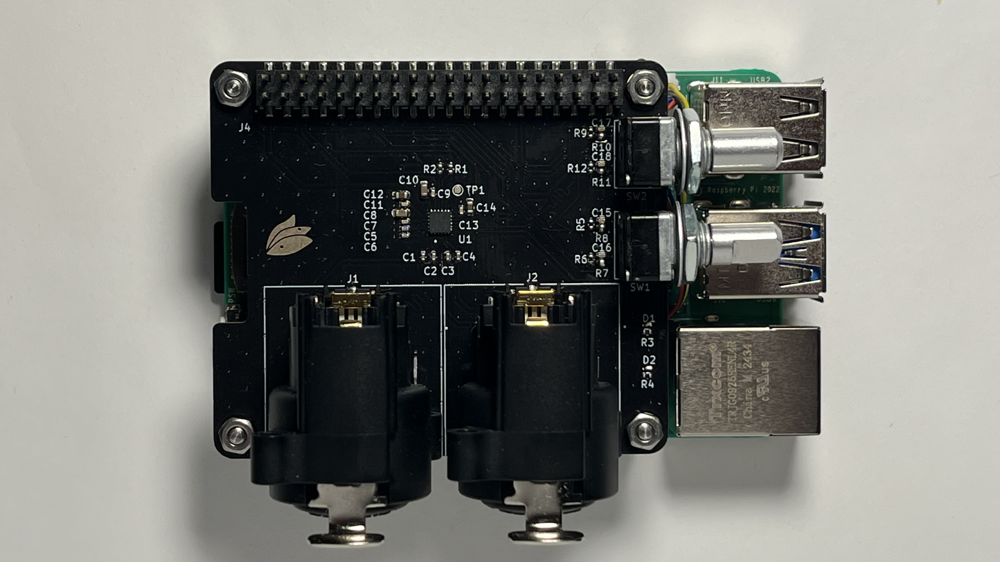

# LotusWorks ADC6120 HAT

A Raspberry Pi HAT built around the Texas Instruments TLV320ADC6120 — a high-performance 2-channel Burr-Brown audio ADC with up to 123 dB dynamic range, programmable analog PGA, mic bias, and I²S output. The HAT provides two balanced XLR mic/line inputs with hardware gain control via rotary encoders and clipping indicator LEDs.

This repository contains all supporting software (`software/`).



---

## Hardware

| | |
|:---:|:---:|
|  |  |

---

## Repository Contents

| Path | Description |
|------|-------------|
| `lw_adc/` | KiCad PCB project — schematic, layout, BOM |
| `software/install_driver.sh` | Main installer — builds and installs the out-of-tree kernel module, device tree overlay, and services |
| `software/lw-adc6120.dts` | Device tree overlay (DSP_A / TDM 2×32, I²C address 0x4E) |
| `software/patches/` | Kernel driver patches applied during install (see below) |
| `software/lw-record` | Recording helper script (stereo, mono, dual-mono; configurable rate/depth/duration) |
| `software/asound.conf` | ALSA configuration giving the device a friendly name (`LotusWorksADC61`) |
| `software/lw_hat_ctrl.py` | HAT control daemon — rotary encoders adjust analog gain per channel |
| `software/lw-adc-hat-ctrl.service` | systemd unit for the HAT control daemon |
| `software/test_rates.sh` | Sweeps all supported sample rates and reports pass/fail |

---

## Driver Patches

The installer applies the following patches to the upstream `tlv320adcx140` kernel driver before building:

| Patch | Description |
|-------|-------------|
| `0001` | Disable CH3/CH4 ADC modulators (unused inputs) |
| `0002` | Expand supported sample rates from 8 kHz to 192 kHz |
| `0003` | Fix CH2 I²S slot assignment (ASI_CH2 register default is wrong for I²S mode) |
| `0004` | Expose per-channel gain sign bit as ALSA controls, enabling negative gain |

---

## Supported Recording Modes

**Sample rates:** 8 kHz, 16 kHz, 32 kHz, 44.1 kHz, 48 kHz, 88.2 kHz, 96 kHz, 176.4 kHz, 192 kHz

**Bit depths:** 16-bit, 24-bit, 32-bit

> `lw-record` always captures from the hardware in S32\_LE and converts to the requested depth via `sox` on output. When using `arecord` directly, use `-f S32_LE` — see [Direct arecord](#direct-arecord) below.

**Channel configurations:**
- Stereo (XLR1 = left, XLR2 = right)
- Mono from XLR1 only
- Mono from XLR2 only
- Dual-mono (both channels to separate files simultaneously)

> **Note:** Rates above 48 kHz require compatible playback software (e.g. a DAW). For standard delivery, downsample with a high-quality SRC: `sox input.wav -r 48000 output.wav rate -v -L`

---

## Analog Gain

Each XLR channel has an independent rotary encoder controlling the TLV320ADC6120 analog PGA gain. The full range is **−11 dB to +42 dB** in 1 dB steps.

| Direction | Behaviour |
|-----------|-----------|
| Clockwise | Increase gain |
| Counter-clockwise | Decrease gain |
| CCW past 0 dB | Crosses into negative gain (−1 dB first, floor at −11 dB) |
| CW back through 0 dB | Returns to positive gain |

Gain is set via ALSA controls and persists until the daemon is restarted or the module is reloaded.

---

## Tested Hardware

| Item | Details |
|------|---------|
| SBC | Raspberry Pi 5 |
| OS | Raspberry Pi OS 64-bit (Debian Bookworm) |
| Kernel | 6.12.47+rpt-rpi-2712 |
| Codec | TI TLV320ADC6120 (I²C address 0x4E) |
| I²S format | I²S, BCLK and FSYNC master on CPU |
| Driver source | Upstream `linux-6.12.y` (`tlv320adcx140`) + LotusWorks patches |

The installer auto-detects the running kernel version and pulls the matching upstream source branch, so it should work on any 6.x Raspberry Pi kernel without manual changes.

---

## Setup

**Prerequisites:** internet access and kernel headers (installed automatically by the script).

```bash
git clone https://github.com/lotusworks/lw_adc.git
cd lw_adc/software
sudo ./install_driver.sh
sudo reboot
```

After reboot, verify the device is recognised:

```bash
arecord -l           # should list LotusWorks ADC6120
dmesg | grep tlv320  # driver bind messages
```

**Other installer options:**

```bash
sudo ./install_driver.sh --build-only  # compile only, no system install
sudo ./install_driver.sh --uninstall   # remove driver, overlay, and services
```

---

## Usage

### lw-record

`lw-record` is installed to `/usr/local/bin/lw-record` and is the recommended way to capture audio. It automatically stops the HAT control daemon before recording (freeing the ALSA device) and restarts it afterwards.

```
lw-record [OPTIONS] MODE OUTPUT

Modes:
  stereo      OUTPUT.wav   — both channels, XLR1=L XLR2=R
  mono1       OUTPUT.wav   — XLR1 only
  mono2       OUTPUT.wav   — XLR2 only
  dual-mono   PREFIX       — PREFIX_ch1.wav + PREFIX_ch2.wav

Options:
  -r RATE    sample rate (default: 48000)
             8000 | 16000 | 32000 | 44100 | 48000 | 88200 | 96000 | 176400 | 192000
  -d SECS    duration in seconds  (default: 5)
  -b BITS    output bit depth: 16 | 24 | 32  (default: 32)
  -h         show help
```

**Examples:**

```bash
# 5-second stereo take at 48 kHz / 32-bit
lw-record stereo take1.wav

# 30-second high-res stereo at 192 kHz / 24-bit output
lw-record -r 192000 -b 24 -d 30 stereo session.wav

# Mono from XLR1, 10 seconds
lw-record -d 10 mono1 vocal.wav

# Split dual-mono — produces interview_ch1.wav and interview_ch2.wav
lw-record -d 60 dual-mono interview
```

### Direct arecord

The ALSA hardware device is `hw:LotusWorksADC61`. `S32_LE` and `S16_LE` both work correctly. Avoid `S24_LE` — the RP1 DMA path does not sign-extend the upper byte, corrupting negative samples (half-wave rectification).

```bash
# 32-bit capture (recommended)
arecord -D hw:LotusWorksADC61 -c 2 -f S32_LE -r 48000 -d 5 out.wav

# 16-bit capture
arecord -D hw:LotusWorksADC61 -c 2 -f S16_LE -r 48000 -d 5 out.wav
```

To produce a 24-bit output file, capture in S32\_LE and convert:

```bash
sox out.wav -b 24 out24.wav
```

> **Note:** Clip detection is disabled by default, so the HAT control daemon does not hold the ALSA device open and `arecord` can be used freely alongside it. If clip detection is re-enabled (`CLIP_DETECTION_ENABLED = True` in `lw_hat_ctrl.py`), the daemon will exclusively hold the device and must be stopped before using `arecord` directly. `lw-record` handles this automatically regardless.

### HAT Control Daemon

The daemon reads the two rotary encoders and updates the analog gain on each channel in real time. It is managed by systemd:

```bash
sudo systemctl start   lw-adc-hat-ctrl
sudo systemctl stop    lw-adc-hat-ctrl
sudo systemctl status  lw-adc-hat-ctrl
```

Run with verbose logging for debugging:

```bash
sudo systemctl stop lw-adc-hat-ctrl
sudo python3 /opt/lw-adc-hat/lw_hat_ctrl.py -v
```

Current gain values can be inspected at any time via ALSA:

```bash
amixer -c LotusWorksADC61 cget name="Analog CH1 Mic Gain Volume"
amixer -c LotusWorksADC61 cget name="Analog CH1 Gain Sign"
amixer -c LotusWorksADC61 cget name="Analog CH2 Mic Gain Volume"
amixer -c LotusWorksADC61 cget name="Analog CH2 Gain Sign"
```
